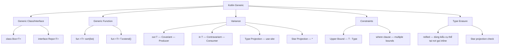

# Kotlin Generics: `in`, `out`, `where`

> [!NOTE]
> Tài liệu tham khảo: [Kotlin Official Docs - Generics](https://kotlinlang.org/docs/generics.html)

**Cách đọc ví dụ:** mỗi đoạn minh họa một ý, không ghép toàn bộ thành một file. Dòng ghi “không biên dịch” là ví dụ lỗi có chủ ý; `User` là model của ứng dụng. Xem thêm [30 câu hỏi và trả lời](kotlin_generics_qa.md).

---

## 1. Khái niệm Generic là gì?

**Generic** (kiểu tổng quát) cho phép bạn viết class, interface, hoặc function mà **không cần xác định kiểu dữ liệu cụ thể** ngay lúc khai báo. Kiểu dữ liệu sẽ được chỉ định sau khi sử dụng.

**Tại sao cần Generic?**
- ✅ **Type Safety** — Compiler kiểm tra kiểu tại compile-time, giảm lỗi dùng sai kiểu. Ép kiểu không kiểm tra hoặc dữ liệu từ Java vẫn có thể gây `ClassCastException`.
- ✅ **Tái sử dụng code** — Viết 1 lần, dùng cho nhiều kiểu dữ liệu
- ✅ **Loại bỏ ép kiểu thủ công** — Không cần cast khi lấy phần tử ra

**Ví dụ đơn giản — Không dùng Generic:**
```kotlin
class IntBox(val value: Int)
class StringBox(val value: String)
// Phải viết riêng cho mỗi kiểu → lặp code!
```

**Dùng Generic:**
```kotlin
class Box<T>(val value: T)

val intBox = Box(42)          // Box<Int>
val strBox = Box("Hello")     // Box<String>
```

> `T` là **type parameter** (tham số kiểu) — đại diện cho một kiểu dữ liệu bất kỳ.

---

## 2. Cách khai báo

### 2.1 Generic Class

```kotlin
class Box<T>(t: T) {
    var value = t
}

// Tạo instance — chỉ định kiểu rõ ràng
val explicitBox: Box<Int> = Box<Int>(1)

// Hoặc để compiler tự suy luận (type inference)
val inferredBox = Box(1)  // Compiler hiểu đây là Box<Int>
```

### 2.2 Generic Interface

```kotlin
interface Repository<T> {
    fun getById(id: Int): T
    fun getAll(): List<T>
    fun save(item: T)
}

class UserRepository : Repository<User> {
    override fun getById(id: Int): User = TODO("Tìm user theo id")
    override fun getAll(): List<User> = TODO("Lấy danh sách user")
    override fun save(item: User) { TODO("Lưu user") }
}
```

### 2.3 Generic Function

Type parameter đặt **trước tên hàm**:

```kotlin
fun <T> singletonList(item: T): List<T> {
    return listOf(item)
}

// Extension function cũng có thể generic
fun <T> T.basicToString(): String {
    return this.toString()
}
```

Gọi hàm generic:
```kotlin
val explicit = singletonList<Int>(1) // Chỉ định kiểu rõ ràng
val inferred = singletonList(1)      // Type inference — compiler tự hiểu T = Int
```

---

## 3. Variance — `out` và `in` (Phần quan trọng nhất!)

### 3.1 Vấn đề: Invariance (Bất biến)

Một kiểu tự khai báo như `Box<T>` không có `in` hoặc `out` là **invariant**: `Box<String>` không phải subtype của `Box<Any>`, dù `String` là subtype của `Any`. Tuy nhiên, **`List` chỉ đọc của Kotlin đã khai báo `out T`**, nên `List<String>` là subtype của `List<Any>`.

```kotlin
val strs: List<String> = listOf("a", "b")
val objs: List<Any> = strs  // ✅ Được: List của Kotlin là covariant
```

`MutableList<T>` là invariant vì vừa đọc vừa ghi. Nếu cho phép gán `MutableList<String>` cho `MutableList<Any>`, code có thể thêm `Int` vào danh sách String:
```kotlin
val strs: MutableList<String> = mutableListOf("a")
// val objs: MutableList<Any> = strs // ❌ Compiler không cho phép
// objs.add(42)                     // Nếu được phép, sẽ thêm Int vào list String
// val s: String = strs[1]          // Khi đó đọc String có thể gây ClassCastException
```

### 3.2 `out` — Covariance (Hiệp biến) — **Producer**

> **Quy tắc:** `T` được dùng ở vị trí **out** trong API. Với method đơn giản, có thể trả trực tiếp `T`, không thể nhận trực tiếp `T` làm tham số công khai. Các kiểu hàm lồng nhau có quy tắc vị trí chi tiết hơn.

```kotlin
interface Source<out T> {
    fun nextT(): T       // ✅ T ở vị trí trả về — OK
    // fun consume(t: T) // ❌ Compile error — T không được ở vị trí tham số
}
```

**Khi dùng `out`:** `Source<String>` trở thành subtype của `Source<Any>`

```kotlin
fun demo(strs: Source<String>) {
    val objects: Source<Any> = strs  // ✅ OK vì T là out-parameter
}
```

**Cách nhớ:** `out` = chỉ **lấy ra** (produce/read) → an toàn để gán subtype cho supertype

**Ví dụ thực tế:** `List<out T>` trong Kotlin standard library là covariant → `List<String>` gán được cho `List<Any>`.

### 3.3 `in` — Contravariance (Nghịch biến) — **Consumer**

> **Quy tắc:** `T` được dùng ở vị trí **in** trong API. Với method đơn giản, có thể nhận trực tiếp `T` làm tham số, không thể trả trực tiếp `T` ra ngoài.

```kotlin
interface Comparable<in T> {
    operator fun compareTo(other: T): Int  // ✅ T ở vị trí tham số — OK
    // fun get(): T                         // ❌ Compile error — T không được ở vị trí trả về
}
```

**Khi dùng `in`:** `Comparable<Number>` trở thành subtype của `Comparable<Double>`

```kotlin
fun demo(x: Comparable<Number>) {
    x.compareTo(1.0)  // OK — Double là subtype của Number
    val y: Comparable<Double> = x  // ✅ OK!
}
```

**Cách nhớ:** `in` = chỉ **đưa vào** (consume/write) → chiều subtype **đảo ngược**

### 3.4 Bảng tóm tắt `in` / `out`

| Modifier | Tên gọi | Vai trò | Chiều subtype | Java tương đương |
|----------|---------|---------|---------------|-----------------|
| `out T` | Covariant | **Producer** — chỉ trả về `T` | `C<Sub>` → `C<Super>` | `? extends T` |
| `in T` | Contravariant | **Consumer** — chỉ nhận `T` | `C<Super>` → `C<Sub>` | `? super T` |
| _(không có)_ | Invariant | Cả đọc và ghi | Không chuyển đổi | `T` |

> [!TIP]
> Quy tắc vàng: **Consumer `in`, Producer `out`!** (CIPO)
> Tương ứng về ý tưởng với PECS trong Java: Producer-Extends, Consumer-Super. `in/out` điều khiển an toàn kiểu, không đảm bảo đối tượng bất biến.

---

## 4. Type Projection (Use-site Variance)

Khi một class **không thể** khai báo `out` hay `in` ở declaration-site (vì dùng `T` ở cả 2 vị trí), ta dùng **type projection** tại nơi sử dụng:

`Array<T>` có sẵn trong Kotlin vừa đọc bằng `array[index]`, vừa ghi bằng `array[index] = value`, nên tham số kiểu của nó là invariant. Không cần tự khai báo lại class `Array`.

### `out` projection — Đọc phần tử, không gán phần tử:
```kotlin
fun copy(from: Array<out Any>, to: Array<Any>) {
    require(to.size >= from.size) // Đích phải đủ chỗ
    for (i in from.indices)
        to[i] = from[i]  // Đọc từ 'from' OK, ghi vào 'to' OK
}

val ints: Array<Int> = arrayOf(1, 2, 3)
val any = Array<Any>(3) { "" }
copy(ints, any)  // ✅ OK! Array<Int> match được Array<out Any>
```

### `in` projection — Ghi đúng kiểu, đọc ở mức kiểu cha:
```kotlin
fun fill(dest: Array<in String>, value: String) {
    for (i in dest.indices) dest[i] = value // Ghi String được
    val first: Any? = dest.firstOrNull()    // Đọc được, nhưng chỉ biết là Any?
    println(first)
}
```

---

## 5. Star Projection (`*`)

Khi bạn **không biết** hoặc **không quan tâm** type argument cụ thể:

```kotlin
val list: List<*> = listOf("An", 1) // Không biết kiểu phần tử cụ thể
```

| Khai báo | `Foo<*>` tương đương |
|----------|---------------------|
| `Foo<out T : TUpper>` | `Foo<out TUpper>` — đọc được `TUpper` |
| `Foo<in T>` | `Foo<in Nothing>` — không ghi được gì |
| `Foo<T : TUpper>` | Đọc: `Foo<out TUpper>`, Ghi: `Foo<in Nothing>` |

```kotlin
// Ví dụ: Kiểm tra kiểu tại runtime
if (something is List<*>) {
    something.forEach { println(it) }  // it có kiểu Any?
}
```

---

`*` không có nghĩa là mọi thao tác đều bị cấm: với `MutableList<*>`, không thêm được phần tử (kể cả null), nhưng vẫn gọi được `clear()` vì hàm này không đưa một giá trị `T` vào danh sách.

## 6. Generic Constraints — Giới hạn kiểu

### 6.1 Upper Bound (Giới hạn trên)

Dùng dấu `:` để chỉ định `T` phải là subtype của một kiểu nào đó:

```kotlin
fun <T : Comparable<T>> sort(list: List<T>): List<T> = list.sorted()

sort(listOf(1, 2, 3))          // ✅ OK — Int implements Comparable<Int>
// sort(listOf(HashMap<Int, String>())) // ❌ HashMap không implement Comparable
```

> Nếu không chỉ định upper bound, mặc định là `Any?`

`T` có thể là kiểu nullable. Dùng `<T : Any>` nếu muốn chỉ chấp nhận kiểu không null.

### 6.2 Nhiều Upper Bound — `where` clause

Khi `T` cần thỏa mãn **nhiều điều kiện** cùng lúc:

```kotlin
fun <T> copyWhenGreater(list: List<T>, threshold: T): List<String>
    where T : CharSequence,
          T : Comparable<T> {
    return list.filter { it > threshold }.map { it.toString() }
}
// T phải vừa là CharSequence, vừa implement Comparable
```

---

## 7. Type Erasure — Xóa kiểu tại Runtime

> [!WARNING]
> Trên JVM, runtime thường không giữ đủ thông tin type argument để kiểm tra một đối tượng generic như `Foo<Bar>` hay `Foo<Baz?>`; cả hai được nhìn ở mức `Foo<*>`. Compiler vẫn kiểm tra generic khi biên dịch, và từng phần tử vẫn có kiểu runtime riêng.

### Hệ quả:
```kotlin
fun inspect(value: Any) {
    // if (value is List<String>) { } // ❌ Không kiểm tra được type argument này
    if (value is List<*>) {           // ✅ Kiểm tra được có phải List hay không
        println(value.size)
    }
}
```

### Kiểm tra kiểu bằng `reified` (chỉ dùng với `inline` function)

```kotlin
inline fun <reified T> isOfType(value: Any?): Boolean {
    return value is T  // ✅ Kiểu T được đưa vào code tại nơi gọi nhờ inline
}

println(isOfType<String>("hello"))  // true
println(isOfType<Int>("hello"))     // false
```

---

**Giới hạn của reified:** `isOfType<List<String>>(listOf(1, 2))` có thể trả `true` vì kiểm tra được phần List, không xác nhận từng phần tử là String. Cần kiểm tra phần tử nếu đó là yêu cầu; cast như `as List<String>` không tự biến đổi dữ liệu.

## 8. Definitely Non-Nullable Types — `T & Any`

Dùng khi interop với Java và cần đảm bảo `T` **không null**:

```java
// Java interface
import org.jetbrains.annotations.NotNull;

public interface Game<T> {
    @NotNull T load(@NotNull T x);
}

```

```kotlin
// Kotlin override
interface ArcadeGame<T1> : Game<T1> {
    override fun load(x: T1 & Any): T1 & Any  // Đảm bảo non-null
}
```

---

`T & Any` biểu diễn giá trị của `T` chắc chắn không null tại vị trí đó, với `T` có upper bound nullable. Khác với `<T : Any>` là ràng buộc toàn bộ type argument không null. Phần này chủ yếu dùng khi làm việc với API Java.

## 9. Underscore Operator `_` cho Type Arguments

Khi có thể suy luận một phần type arguments:

```kotlin
abstract class SomeClass<T> {
    abstract fun execute(): T
}
class SomeImplementation : SomeClass<String>() {
    override fun execute(): String = "Test"
}

object Runner {
    inline fun <reified S : SomeClass<T>, T> run(): T {
        return S::class.java.getDeclaredConstructor().newInstance().execute()
    }
}

fun main() {
    // T tự suy luận là String từ SomeImplementation
    val s = Runner.run<SomeImplementation, _>()
}
```

---

## 10. Tổng kết các trường hợp sử dụng



### Bảng Quick Reference

| Tình huống | Sử dụng | Ví dụ |
|------------|---------|-------|
| Class dùng cho nhiều kiểu | Generic class | `class Box<T>(val value: T)` |
| Hàm dùng cho nhiều kiểu | Generic function | `fun <T> listOf(item: T): List<T>` |
| Chỉ đọc/produce giá trị | `out` (covariant) | `interface Source<out T>` |
| Chỉ ghi/consume giá trị | `in` (contravariant) | `interface Sink<in T>` |
| Vừa đọc vừa ghi, nhưng muốn linh hoạt tại nơi dùng | Type projection | `Array<out Any>`, `Array<in String>` |
| Không biết/quan tâm kiểu | Star projection | `List<*>` |
| Giới hạn kiểu được phép | Upper bound | `<T : Comparable<T>>` |
| Nhiều giới hạn cùng lúc | `where` | `where T : A, T : B` |
| Cần kiểm tra kiểu tại runtime | `reified` + `inline` | `inline fun <reified T> check()` |
